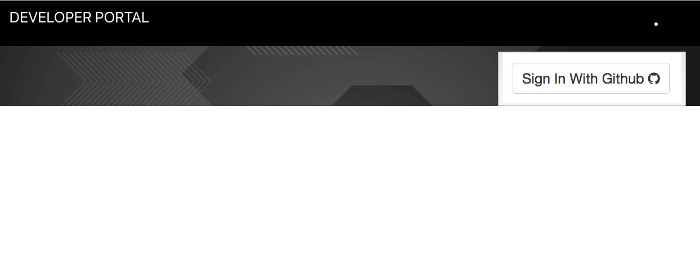

### Developer++
This app is our first React project. It includes a GitHub Profile Card and the ability to track/add/delete development tools. 

## Tech Requirements
* Use create-react-app to start a new react project
* Use GITHUB authentication
* Include a navbar
* Use CRUD to easily add learning materials to the project
* Use radio buttons to categorize a material as a tutorial, blog, documentation, or podcast via CRUD
* Use a checkbox to mark resources as completed, via CRUD. When a resource is marked as completed it should show up at the bottom of the tab it belongs to.
* The ability to delete resources via CRUD.

## Screenshots



## How to run this project:

* Setup Firebase  
  -Create a firebase project  
  -Enable 'Github Authentication'  
  -Create a Firebase Realtime Database  
  -Create an apiKeys.js file (an example file exists in the 'helpers' folder)  

* Clone or download the repo

* Browse to the repo directory in your terminal

* ```npm install``` installs necessary dependencies

* ```npm start``` will run the project at http://localhost:3000
